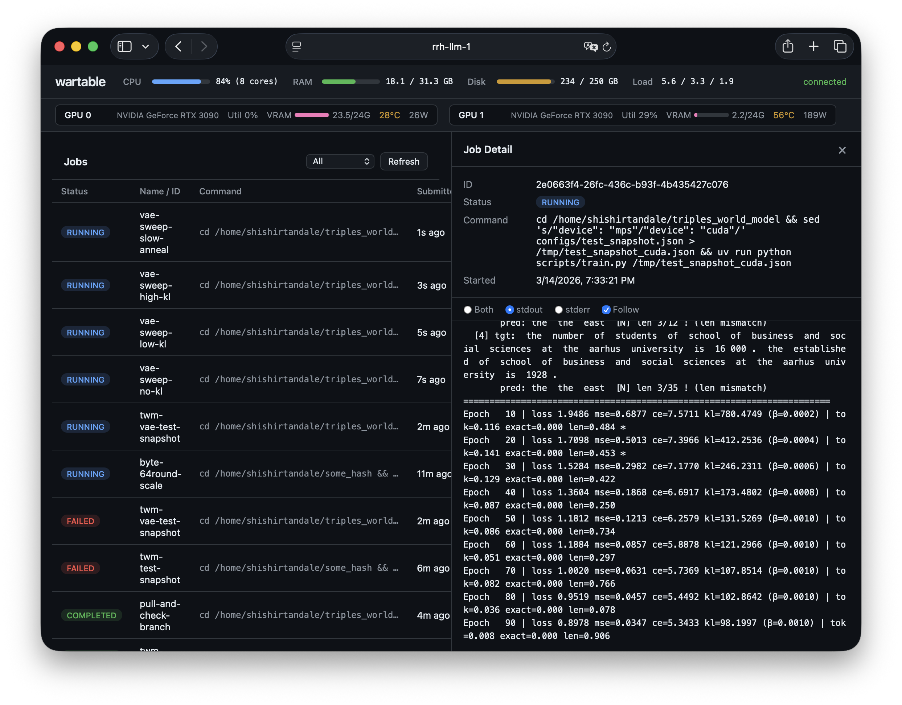

# wartable

Resource-aware job scheduler for GPU homelab servers. Lets multiple Claude Code instances submit and monitor workloads via MCP.

Single Rust binary that serves:
- **MCP server** (streamable HTTP) — Claude Code connects directly
- **Job scheduler** — priority queue, concurrent dispatch, process management
- **Web dashboard** — live job queue, log tailing, GPU/CPU/RAM metrics
- **REST API** + **SSE event stream** — for the dashboard and custom integrations



## Quick Start

### Deploy (systemd)

```bash
git clone git@github.com:tandalesc/wartable.git
cd wartable
./deploy.sh
```

Builds, installs to `/usr/local/bin`, sets up a systemd service. Run `./deploy.sh` again to update.

### Or run manually

```bash
cargo build --release && ./target/release/wartable
```

### Or Docker

```bash
docker compose up -d --build
```

## Claude Code Setup

Add to your MCP config (project `.mcp.json` or user-level):

```json
{
  "mcpServers": {
    "wartable": {
      "type": "http",
      "url": "http://<server-ip>:9400/mcp"
    }
  }
}
```

If auth is enabled, add a `headers` field with your API key. Generate keys from the dashboard's **KEYS** panel:

```json
{
  "mcpServers": {
    "wartable": {
      "type": "http",
      "url": "http://<server-ip>:9400/mcp",
      "headers": {
        "Authorization": "Bearer <key>"
      }
    }
  }
}
```

Restart Claude Code and you'll have `submit_job`, `list_jobs`, `get_job_status`, `get_job_logs`, `cancel_job`, `upload_file`, and `download_file`.

## Push Notifications (Channel)

Optional. The `wartable-channel` pushes job events and log updates into your Claude Code session in real-time — no polling.

**Setup:**

```bash
cd wartable/channel && npm install
```

Register the channel in your project:

```bash
claude mcp add wartable-channel -s project -- npx tsx /path/to/wartable/channel/wartable-channel.ts
```

Then edit `.mcp.json` to add the `env` block with your server URL and API key:

```json
{
  "mcpServers": {
    "wartable-channel": {
      "command": "npx",
      "args": ["tsx", "/path/to/wartable/channel/wartable-channel.ts"],
      "env": {
        "WARTABLE_URL": "http://<server-ip>:9400",
        "WARTABLE_API_KEY": "<key>"
      }
    }
  }
}
```

`WARTABLE_API_KEY` is required when auth is enabled (the default). Generate a key from the dashboard's **KEYS** panel.

Start Claude Code with the channel enabled:

```bash
claude --dangerously-load-development-channels server:wartable-channel
```

**What you get:**

- Job lifecycle events pushed automatically (`job_submitted`, `job_started`, `job_completed`, `job_cancelled`)
- `subscribe_job_logs` tool — subscribe to periodic log updates for long-running jobs (configurable interval, auto-stops on completion)
- `unsubscribe_job_logs` / `list_log_subscriptions` for managing subscriptions

## Configuration

All optional. Defaults work out of the box. Create `~/.wartable/config.toml` to customize:

```toml
[server]
host = "0.0.0.0"
port = 9400
# base_url = "http://my-server:9400"

[scheduler]
max_concurrent_jobs = 8

[scheduler.gpu]
# policy = "least-loaded"               # or "packed"
# device_env_var = "CUDA_VISIBLE_DEVICES"
# vram_gb = [22.0, 22.0]                # override per-device VRAM budget (GB)

[workers]
default_working_dir = "/opt/wartable/jobs"
log_dir = "/opt/wartable/logs"
kill_grace_period_secs = 10
# extra_allowed_dirs = ["~/projects"]

[auth]
enabled = true  # default; set to false to disable
# api_keys = [{ name = "my-client", key = "wt-secret" }]

[dashboard]
enabled = true
```

### Authentication

Auth is **enabled by default**. All routes require an API key. The dashboard auto-authenticates via session cookie (an admin key is printed to stdout on startup). Generate keys for MCP clients from the dashboard's **KEYS** panel, or pre-configure them in `config.toml`. Set `[auth] enabled = false` to disable.

### Permissions

Jobs run as the wartable process owner. The deploy script creates a `wartable` system user by default. Use `WARTABLE_USER=myuser ./deploy.sh` to run as a different user. If running manually (`cargo run`), jobs use your current user.

For GPU access, the deploy script adds the user to `video` and `render` groups automatically.

### GPU Scheduling

Jobs can request GPU resources via `gpu_count` and `gpu_vram_min_gb` in their resource requirements. The scheduler tracks a per-device VRAM **budget** (not live usage) and only dispatches a job when enough headroom exists.

When a job is dispatched, the scheduler injects `CUDA_VISIBLE_DEVICES` (configurable via `device_env_var`) so the process only sees its assigned GPUs. VRAM budgets are released when the job completes, fails, or is cancelled.

**Policies:**

| Policy | Behavior |
|---|---|
| `least-loaded` (default) | Picks GPUs with the most free VRAM budget. Spreads work to reduce contention. |
| `packed` | Fills lowest-indexed GPU first. Keeps some GPUs idle for interactive use. |

**Example — submitting a job that needs 8 GB VRAM on 1 GPU:**

```json
{
  "command": "python train.py",
  "gpu_count": 1,
  "gpu_vram_min_gb": 8.0
}
```

The scheduler will pick a GPU with at least 8 GB of free budget, set `CUDA_VISIBLE_DEVICES=<idx>`, and reserve 8 GB against that device until the job finishes.

**Overriding VRAM budgets:** By default, total VRAM per GPU is auto-detected via NVML. Use `[scheduler.gpu] vram_gb` to cap or override (e.g., to leave headroom for the desktop compositor). If NVML is unavailable and `vram_gb` is not set, GPU budget enforcement is skipped and jobs will dispatch without GPU restrictions.

**Custom device env var:** Some frameworks use different env vars (e.g., `HIP_VISIBLE_DEVICES` for ROCm). Set `device_env_var` accordingly.

## Architecture

```
Claude Code ──MCP──┐
Claude Code ──MCP──┼──► Axum (:9400) ──► Scheduler Actor ──► Worker Pool
Browser ──HTTP─────┘         │
Channel ──SSE──────────── Event Bus ──► Dashboard
```
